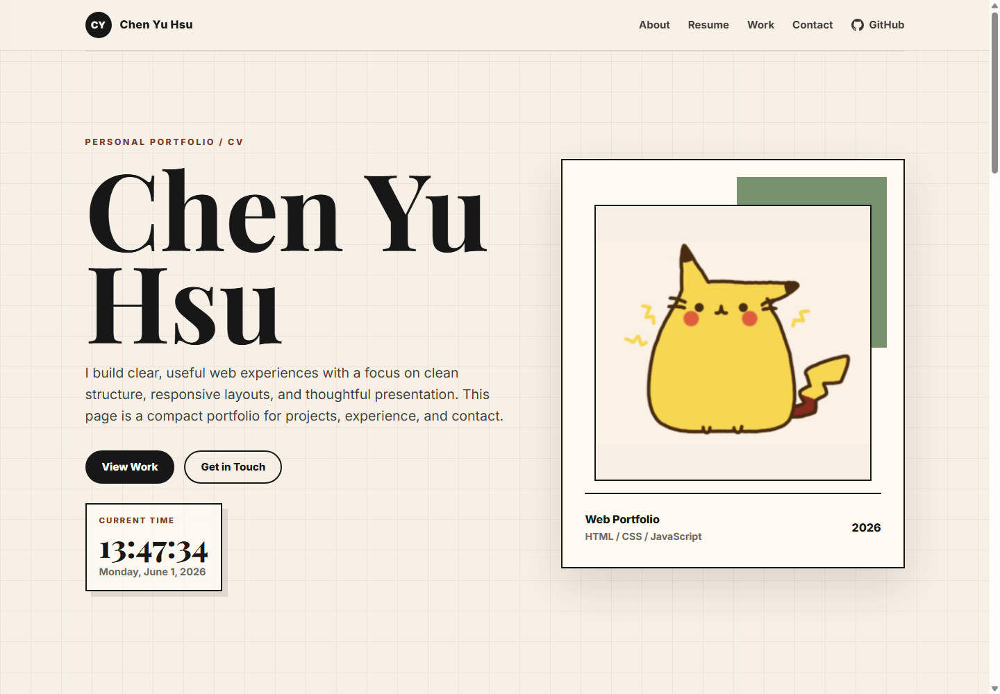

# ChenYu - Personal Portfolio

Repo: [ChenYuHsu413/ChenYu](https://github.com/ChenYuHsu413/ChenYu)

A responsive personal portfolio website for Chen Yu Hsu. The site includes a hero profile section, live current time display, resume-style content, selected work cards, contact links, and a GitHub repository shortcut in the navigation bar.

## Live Demo

[View the live site](https://chenyuhsu413.github.io/ChenYu/)



## Features

- Responsive portfolio layout for desktop and mobile.
- Live current time and date display updated every second.
- Sticky header navigation with GitHub repository link.
- About, resume, work, and contact sections.
- Separate HTML, CSS, and JavaScript files for easier maintenance.

## Tech Stack

- HTML5
- CSS3
- Vanilla JavaScript
- Google Fonts
- GitHub Pages

## File Structure

```text
ChenYu/
|-- index.html
|-- style.css
|-- script.js
|-- README.md
|-- docs/
|   |-- AGENT.md
|   |-- dev-log.md
|   `-- 工作報告.md
`-- sources/
    |-- demo-screenshot.png
    `-- workflow_infographic.jpg
```

## File Notes

- `index.html`: Main page structure and content.
- `style.css`: All visual styling, layout rules, responsive design, and component styles.
- `script.js`: Live clock logic for updating the current time and date.
- `README.md`: Project overview, setup notes, and file structure.
- `docs/AGENT.md`: Working rules for AI-assisted project maintenance.
- `docs/dev-log.md`: Development log maintained according to `docs/AGENT.md`.
- `docs/工作報告.md`: Project report with the daily work log merged into the opening section.
- `sources/demo-screenshot.png`: Homepage preview image shown in this README.
- `sources/workflow_infographic.jpg`: Supporting image asset used by the project report.

## How to Run Locally

Open `index.html` directly in a browser, or run a local static server from the project folder:

```bash
npx http-server
```

Then open `http://127.0.0.1:8080` in your browser.

