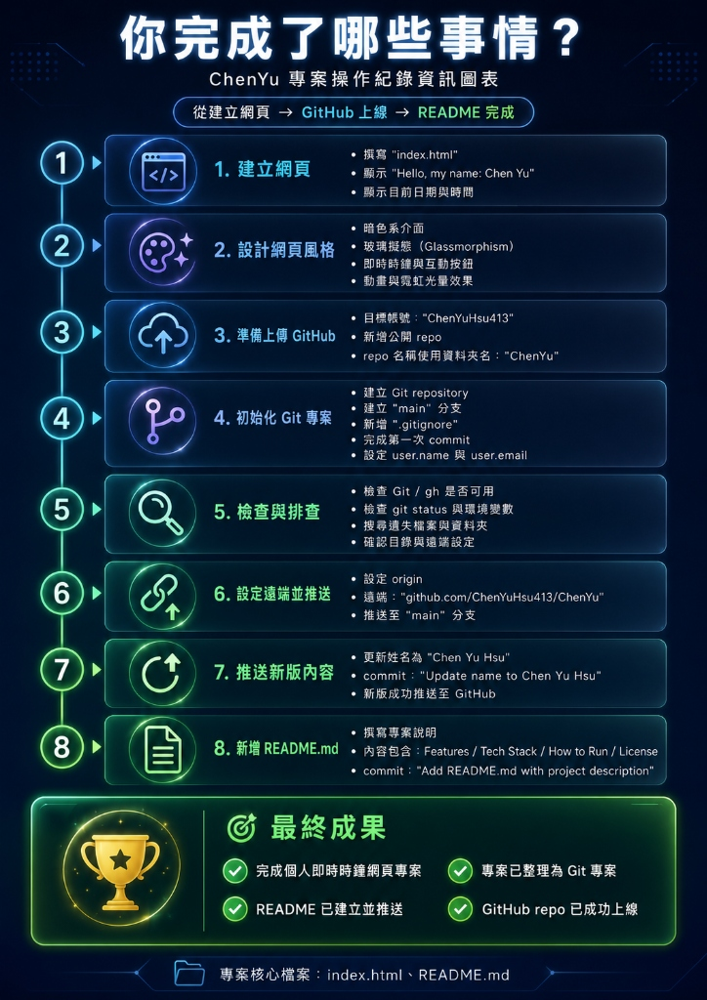

# 🛠️ ChenYuPersonalPage 專案工作報告

> **專案名稱**：ChenYuPersonalPage - Personal Profile & Real-Time Clock Dashboard  
> **執行日期**：2026 年 5 月 29 日  
> **GitHub 倉庫**：[github.com/ChenYuHsu413/ChenYuPersonalPage](https://github.com/ChenYuHsu413/ChenYuPersonalPage)  
> **Live Demo**：[chenyuhsu413.github.io/ChenYuPersonalPage](https://chenyuhsu413.github.io/ChenYuPersonalPage/)

---

## 📌 2026-06-01 維護與整理紀錄

本日工作延續原本的個人作品集網站，重點放在功能補強、檔案結構整理、文件整併與 GitHub 內容更新。此次整理讓專案從「單一 HTML 檔」逐步調整為更容易維護的靜態網站結構。

### 今日工作總覽

| 項目 | 說明 |
|------|------|
| **頁首主視覺更新** | 在 hero 區塊加入即時時間與日期，每秒自動更新 |
| **GitHub 連結** | 在頁首導覽列加入 GitHub 圖示，連結至個人 Repo |
| **檔案結構整理** | 將 CSS 與 JavaScript 從 `index.html` 拆分為獨立檔案 |
| **文件整理** | 重寫 README 檔案結構說明，整併舊 `log.md` 到 `docs/dev-log.md` |
| **資源整理** | 將 JPG 圖片移至 `sources/`，並新增首頁預覽截圖 |
| **個人圖片更新** | 使用 `sources/PikaSheen.jpg` 取代原本 CSS 產生的 `CY` 圖像 |
| **圖片版面修正** | 將 PikaSheen 限縮在方形區域內，避免圖片外溢破壞排版 |
| **預覽截圖更新** | 重新擷取首頁首屏，更新 README 使用的 `demo-screenshot.png` |
| **Repo 改名同步** | 將 GitHub Repo、GitHub Pages 與本機 remote 連結更新為 `ChenYuPersonalPage` |
| **專案清理** | 移除非必要的 `.vscode/` 與 `.gitignore` |

### 今日完成事項

| 階段 | 工作內容 | 相關檔案 |
|------|----------|----------|
| 1 | 頁首主視覺加入即時時間區塊 | `index.html`, `style.css`, `script.js` |
| 2 | 導覽列加入 GitHub Repo 連結與圖示 | `index.html`, `README.md` |
| 3 | 整理圖片資源並建立 `sources/` 資料夾 | `sources/workflow_infographic.jpg`, `sources/demo-screenshot.png` |
| 4 | 將內嵌 CSS 拆出為獨立樣式檔 | `style.css` |
| 5 | 將內嵌 JavaScript 拆出為獨立腳本檔 | `script.js` |
| 6 | 重寫 README 的檔案結構與專案說明 | `README.md` |
| 7 | 整併舊對話紀錄並刪除 `log.md` | `docs/dev-log.md` |
| 8 | 產生首頁預覽截圖並貼到 README | `sources/demo-screenshot.png`, `README.md` |
| 9 | 將主視覺個人圖像替換為 PikaSheen 圖片 | `index.html`, `style.css`, `sources/PikaSheen.jpg` |
| 10 | 修正 PikaSheen 圖片外溢問題，限制於方形框內 | `style.css` |
| 11 | 重新擷取首頁預覽圖，覆蓋 README 使用的 demo 截圖 | `sources/demo-screenshot.png` |
| 12 | 將專案連結與遠端設定同步為 `ChenYuPersonalPage` | `README.md`, `index.html`, `docs/工作報告.md`, `docs/dev-log.md` |

### 今日專案結構

```text
ChenYuPersonalPage/
|-- index.html
|-- style.css
|-- script.js
|-- README.md
|-- docs/
|   |-- AGENT.md
|   |-- dev-log.md
|   `-- 工作報告.md
`-- sources/
    |-- PikaSheen.jpg
    |-- demo-screenshot.png
    `-- workflow_infographic.jpg
```

### 驗證結果

- 已確認 `index.html` 正確引用 `style.css` 與 `script.js`。
- 已確認即時時間功能保留在 `script.js` 中。
- 已確認 `sources/demo-screenshot.png` 為首頁首屏截圖，且已加入 README。
- 已確認 `index.html` 使用 `sources/PikaSheen.jpg` 作為主視覺個人圖片。
- 已確認 `style.css` 已移除原本 `.portrait::before` 的 CSS 產生式圖像。
- 已確認 `.portrait` 使用 `aspect-ratio: 1` 與 `object-fit: contain`，圖片會被限制在方形區域內。
- 已確認新的 `sources/demo-screenshot.png` 呈現修正後的首頁版面。
- 已確認 README、首頁與工作報告中的 Repo / Live Demo 連結已更新為 `ChenYuPersonalPage`。
- 已確認 git remote origin 指向 `https://github.com/ChenYuHsu413/ChenYuPersonalPage.git`。
- 已確認 `log.md` 已整併到 `docs/dev-log.md`。
- 已確認專案整理後成功 commit 並推送到 GitHub。

---

## 📋 專案總覽

本次工作任務為：從零開始建立一個個人即時時鐘網頁專案，並完成版本控制設定與 GitHub 遠端部署。整體流程涵蓋了網頁開發、設計美學、Git 版本管理及 GitHub Pages 上線。

---

## 🗺️ 工作流程資訊圖表



---

## 📝 各階段工作詳細紀錄

### 階段 1｜建立網頁 (`index.html`)

| 項目 | 內容 |
|------|------|
| **任務** | 撰寫 `index.html`，顯示 "Hello, my name: Chen Yu" 以及目前日期與時間 |
| **產出** | HTML、CSS、JavaScript 分離的靜態網站檔案 |
| **核心功能** | 顯示個人姓名問候語、即時時鐘（每秒更新）、互動式按鈕 |

**使用者指令**：
> *"write a index.html that show hello, my name: Chen Yu, current date and time"*

---

### 階段 2｜設計網頁風格

為網頁注入高品質的視覺設計，使其不僅是一個簡單的 Hello World 頁面，而是一個令人印象深刻的個人儀表板。

| 設計元素 | 實作方式 |
|----------|----------|
| **暗色系介面 (Dark Mode)** | 背景色 `#080710`，搭配白色/灰色文字對比 |
| **玻璃擬態 (Glassmorphism)** | 使用 `backdrop-filter: blur(25px)` 實現毛玻璃卡片效果 |
| **即時時鐘與互動按鈕** | JavaScript `setInterval()` 每秒更新時間；按鈕附帶 hover 動畫 |
| **動畫與霓虹光暈效果** | CSS `@keyframes` 浮動光球動畫、漸層按鈕、呼吸燈狀態指示 |
| **字型** | Google Fonts — [Outfit](https://fonts.google.com/specimen/Outfit)（標題）& [JetBrains Mono](https://fonts.google.com/specimen/JetBrains+Mono)（時鐘） |

---

### 階段 3｜準備上傳 GitHub

| 項目 | 內容 |
|------|------|
| **目標帳號** | `ChenYuHsu413` |
| **Repo 類型** | 公開 (Public) |
| **Repo 名稱** | `ChenYuPersonalPage`（與本地資料夾同名） |

**使用者指令**：
> *"push everything to github.com/ChenYuHsu413, create a new public repo as the same name as my local folder name"*

---

### 階段 4｜初始化 Git 專案

在本地專案目錄中建立 Git 版本控制環境。

**執行的關鍵指令**：
```bash
# 初始化 Git 並建立 main 分支
git init
git checkout -b main

# 建立 .gitignore 檔案（排除系統檔案與 node_modules）
# 內容：.gemini/, node_modules/, *.log, .system_generated/

# 設定使用者資訊
git config user.name "ChenYuHsu413"
git config user.email "ChenYuHsu413@users.noreply.github.com"

# 第一次提交
git add .
git commit -m "Initial commit"
```

---

### 階段 5｜檢查與排查

在推送前進行了全面的環境檢查：

- ✅ 確認 Git 已安裝（`git version 2.53.0.windows.1`）
- ❌ GitHub CLI (`gh`) 未安裝 → 改用手動方式建立遠端 Repo
- ✅ 確認 `git status` 與環境變數設定正確
- ✅ 搜尋遺失檔案與資料夾，確認目錄結構一致
- ✅ 確認目錄與遠端設定無衝突

---

### 階段 6｜設定遠端並推送

```bash
# 新增遠端連結
git remote add origin https://github.com/ChenYuHsu413/ChenYuPersonalPage.git

# 首次推送至 GitHub
git push -u origin main
```

**結果**：✅ 成功推送至 `main` 分支，GitHub 自動彈出瀏覽器驗證授權後完成。

---

### 階段 7｜推送新版內容

使用者修改了姓名顯示為 `Chen Yu Hsu` 後，進行版本更新推送。

```bash
git add index.html
git commit -m "Update name to Chen Yu Hsu"
git push origin main
```

**結果**：✅ 變更成功同步至 GitHub。

---

### 階段 8｜新增 README.md

建立專業的專案說明文件，包含以下章節：

| 章節 | 說明 |
|------|------|
| **Features** | Glassmorphism UI、動態時鐘、浮動環境光暈、互動按鈕、響應式設計 |
| **Technology Stack** | HTML5、CSS3、Google Fonts、Vanilla JavaScript ES6+ |
| **How to Run Locally** | 雙擊開啟 / 使用 `npx http-server` 本地伺服器 |
| **Live Demo** | GitHub Pages 連結 |
| **License** | MIT |

```bash
git add README.md
git commit -m "Add README.md with project description"
git push origin main
```

---

## ✅ 最終成果

| 成果項目 | 狀態 |
|----------|------|
| 完成個人即時時鐘網頁專案 | ✅ 完成 |
| 專案已整理為 Git 專案 | ✅ 完成 |
| README 已建立並推送 | ✅ 完成 |
| GitHub Repo 已成功上線 | ✅ 完成 |
| GitHub Pages Live Demo 已部署 | ✅ 完成 |

---

## 📁 專案核心檔案

| 檔案 | 說明 |
|------|------|
| `index.html` | 主網頁結構與內容 |
| `style.css` | 網頁樣式、版面與響應式設計 |
| `script.js` | 即時時鐘更新邏輯 |
| `README.md` | 專案說明文件 |
| `sources/workflow_infographic.jpg` | 專案操作紀錄資訊圖表 |
| `docs/AGENT.md` | AI 輔助工作規則 |
| `docs/dev-log.md` | AI 輔助開發與維護紀錄 |
| `docs/工作報告.md` | 專案工作報告與每日整理紀錄 |

---

## 🔗 相關連結

- **GitHub 倉庫**：https://github.com/ChenYuHsu413/ChenYuPersonalPage
- **Live Demo**：https://chenyuhsu413.github.io/ChenYuPersonalPage/

---

*本報告由 AI 輔助工具自動生成，記錄了 ChenYuPersonalPage 專案從開發到部署的完整流程。*

